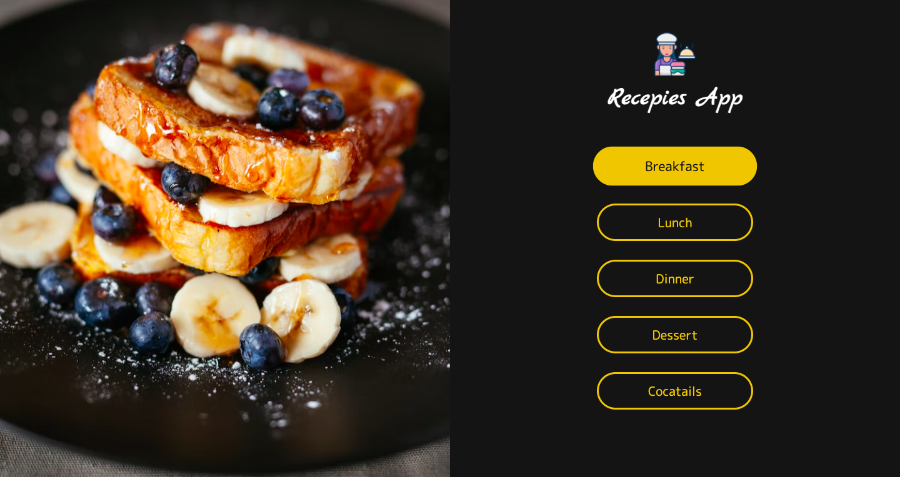
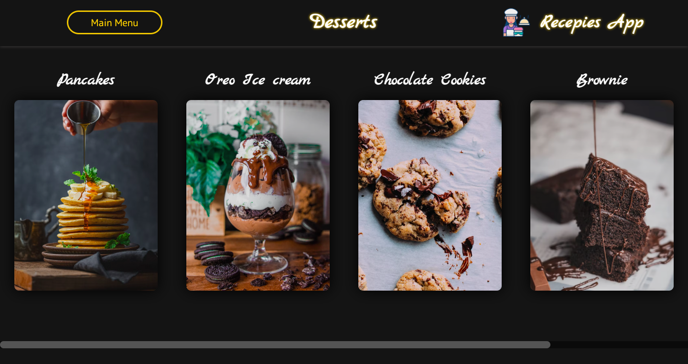

# Recipes App

This is the repository for my own project Recipes App

# About The App

Recipes App is my first project in React build without any tutorial.
It allows you to search for a recipes for a meal that are stored in foodData.js file.

# Screenshots of application

# Technologies

To build this project I used React / React Router / CSS

# Setup

To run this project:

- Clone this repository

- Enter food_app folder that is nested in folder you have cloned

- Run `npm install`

- Run `npm start`

- Open your browser and search for `http://localhost:3000`

# Status

This is version 1.0 of this application. Soon I will implement function that will allow you to add your own recipes.

